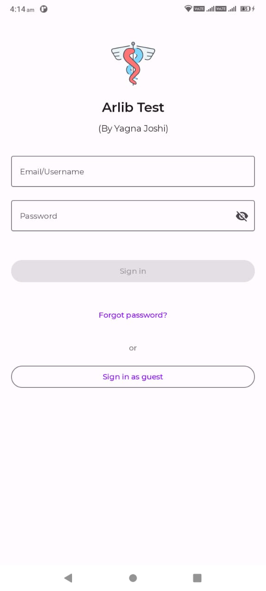
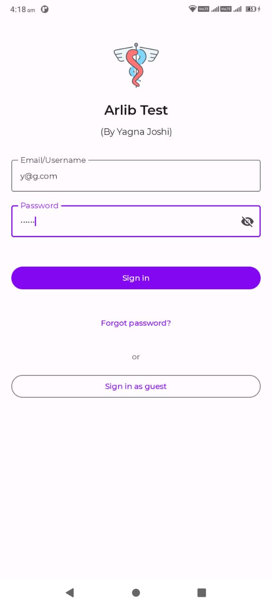
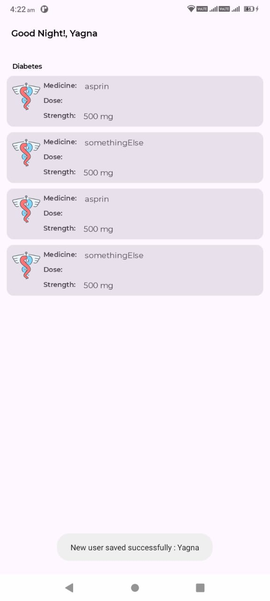
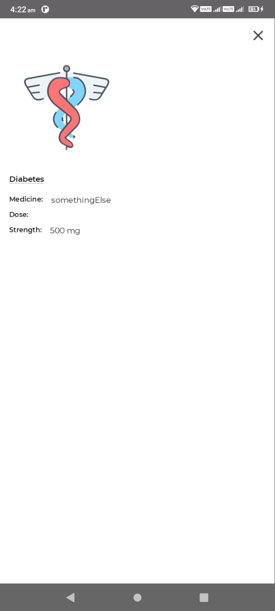

# Arlib Test by Yagna Joshi

Arlib Test is a sample app, built with
[Jetpack Compose](https://developer.android.com/jetpack/compose).

To try out this sample app, use the latest stable version
of [Android Studio](https://developer.android.com/studio).
You can clone this repository or import the
project from Android Studio following the steps
[here](https://developer.android.com/jetpack/compose/setup#sample).

### Libraries Used

* [Jetpack Compose][21] - For UI and Decoration Jetpack composable framework has been user. No XML design user for layouts.
* [Architecture][10] - The app uses MVVM architecture to have a unidirectional flow of data, separation of concern, testability, and a lot more.
* [Lifecycles][11] - Create a UI that automatically responds to lifecycle events.
* [Navigation][12] - Nav graph & routes are used to handle navigation from one to another screen
* [ViewModel][13] - Viewmodel for holding data, room db calls and  for REST api calls
* [Coroutines][34] - Coroutines used performing room db  and  for REST Api calls in background asynchronously
* [RoomDB][36] - Used for storing email/username and password. If user already exist then sign success otherwise save user and then signin success

* Third party libraries
  * [Retrofit][30] for turns your HTTP API into a Java interface
  * [Gson][31] for convert Java Objects into their JSON representation
  * [Hilt][32] for [dependency injection][33]

## APK 
<a href="https://github.com/yagnajoshi/Arlib-Test-Jetpack-ComposeUI/blob/main/apk/ArlibTestByYagna.apk">Arlib Test APK</a>

## Screenshots






## Features

This sample contains several screens: a SigIn screen, where the user can enter their email/Username and password to sign in. Also user can use "Signin as Guest" for quick look. The app has light and dark themes support.

### App scaffolding

Package [`com.arlib.compose.test`][1]

[`MainActivity`][2] is the application's entry point. Each screen is implemented inside a `Fragment` and [`MainActivity`][2] is the host `Activity` for all of the `Fragment`s.
The navigation between them uses the [Navigation library][3]. The screens and the navigation are defined in [`Navigation.kt`][4]

[1]: app/src/main/java/com/arlib/compose/test
[2]: app/src/main/java/com/arlib/compose/test/MainActivity.kt
[3]: https://developer.android.com/guide/navigation
[4]: app/src/main/java/com/arlib/compose/test/Navigation.kt


## License

```
Copyright 2020 The Android Open Source Project

Licensed under the Apache License, Version 2.0 (the "License");
you may not use this file except in compliance with the License.
You may obtain a copy of the License at

    https://www.apache.org/licenses/LICENSE-2.0

Unless required by applicable law or agreed to in writing, software
distributed under the License is distributed on an "AS IS" BASIS,
WITHOUT WARRANTIES OR CONDITIONS OF ANY KIND, either express or implied.
See the License for the specific language governing permissions and
limitations under the License.
```
[1]: https://www.balldontlie.io/#introduction
[10]: https://developer.android.com/jetpack/compose/architecture
[11]: https://developer.android.com/jetpack/compose/lifecycle
[12]: https://developer.android.com/jetpack/compose/navigation
[13]: https://developer.android.com/jetpack/compose/state#viewmodel-state
[14]: https://kotlinlang.org/docs/flow.html
[15]: https://developer.android.com/training/data-storage/room
[20]: https://developer.android.com/jetpack/compose/tutorial
[21]: https://developer.android.com/jetpack/compose
[30]: https://square.github.io/retrofit/
[31]: https://github.com/google/gson
[32]: https://developer.android.com/training/dependency-injection/hilt-android
[33]: https://developer.android.com/training/dependency-injection
[34]: https://developer.android.com/kotlin/coroutines
[35]: https://github.com/airbnb/lottie-android
[36]: https://developer.android.com/training/data-storage/room
